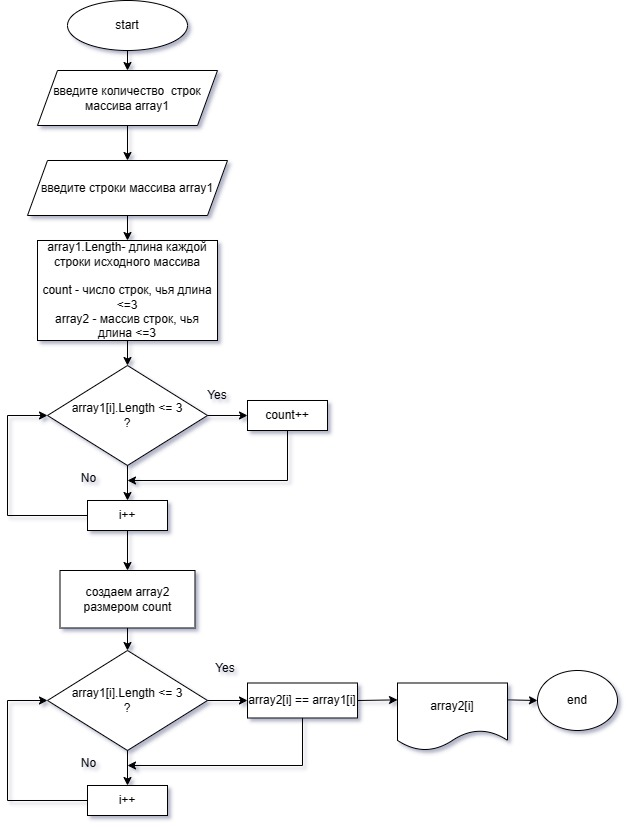

Данный код реализует алгоритм, который из имеющегося массива строк формирует новый массив, состоящий из строк исходного массива,
длина которых меньше, либо равна 3 символам. 
Первоначальный массив вводится с клавиатуры.

**Блок-схема алгоритма:**

